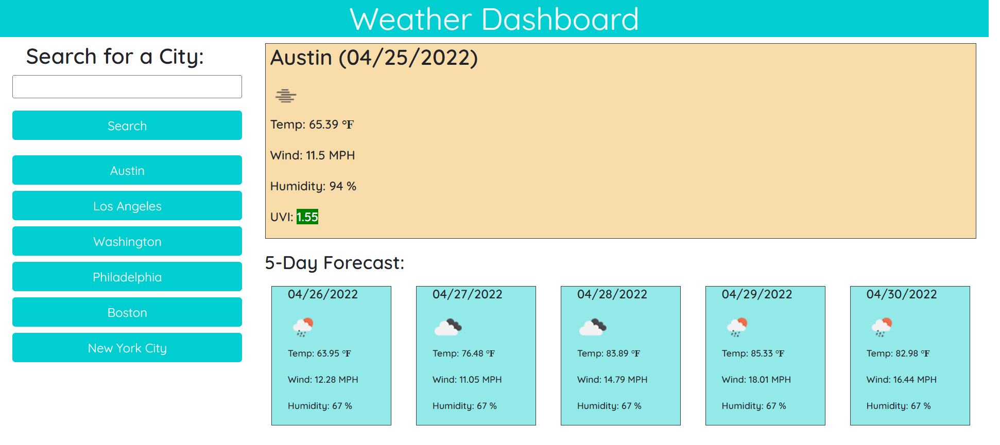

# **Weather Dashboard**

## **Overview**
The purpose of this project was to create a weather dashboard webpage where users can search for different cities and obtain the current weather and 5-Day Forecast for each of the cities. The User Story and Acceptance Criteria are as follows:

### **User Story**
> AS A traveler 
I WANT to see the weather outlook for multiple cities 
SO THAT I can plan a trip accordingly 

### **Acceptance Criteria**
> GIVEN a weather dashboard with form inputs 
WHEN I search for a city 
THEN I am presented with current and future conditions for that city and that city is added to the search history 
WHEN I view current weather conditions for that city 
THEN I am presented with the city name, the date, an icon representation of weather conditions, the temperature, the humidity, the wind speed, and the UV index 
WHEN I view the UV index 
THEN I am presented with a color that indicates whether the conditions are favorable, moderate, or severe 
WHEN I view future weather conditions for that city 
THEN I am presented with a 5-day forecast that displays the date, an icon representation of weather conditions, the temperature, the wind speed, and the humidity 
WHEN I click on a city in the search history 
THEN I am again presented with current and future conditions for that city 

## **Assets Utilized** 

- index.html
- style.css
- script.js
- Data from Open Weather One Call API

## **Built With**
* HTML
* CSS
* JavaScript
* Moment.js library
 
 ## **Deliverable**

**Weather Dashboard:** 
https://sd-github21.github.io/weather-dashboard/

**Screen Shot of Weather Dashboard:** 

